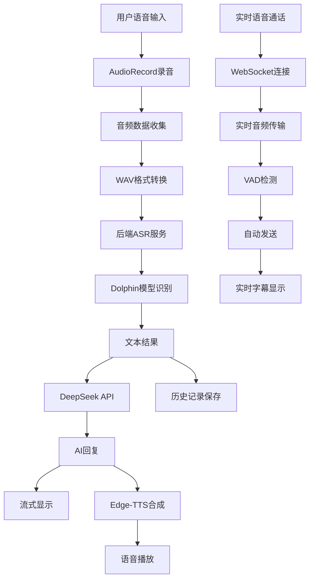

# NEXUS Unified - 企业级智能语音对话系统

<div align="center">


**🚀 下一代智能语音交互平台 - 让AI对话更自然、更智能！**

[快速开始](#-快速开始) • [核心功能](#-核心功能) • [技术架构](#-技术架构) • [使用指南](#-使用指南) • [API文档](#-api文档) • [监控运维](#-监控运维)

</div>

---

## 📱 项目简介

NEXUS Unified 是一个企业级的智能语音对话系统，集成了先进的实时语音识别、AI对话和语音合成功能。系统采用现代化的Jetpack Compose UI框架，提供完整的语音交互解决方案，支持连续对话、历史记录管理、实时监控和自动恢复等企业级特性。

### ✨ 核心亮点
- 🎤 **高精度语音识别**：基于Dolphin模型的实时语音识别，支持16kHz采样率
- 🤖 **智能AI对话**：集成DeepSeek API的流式对话，支持上下文理解和连续对话
- 🔊 **多音色语音合成**：使用Edge-TTS的5种中文音色，支持实时播放和预生成
- 📱 **现代化UI设计**：Jetpack Compose构建的仿微信界面，支持主题切换和字体调节
- 📚 **完整数据管理**：支持对话历史记录、搜索、导出和本地存储
- 🔧 **企业级监控**：实时服务监控、健康检查、自动恢复和性能统计
- 🛡️ **高可用架构**：支持服务自动恢复、错误处理和超时保护
- 🎨 **个性化定制**：支持白天/夜间模式、字体大小调节和主题切换
- 📞 **实时语音通话**：支持连续语音对话模式
- 📝 **实时字幕显示**：对话过程中的实时字幕显示

---

## 🚀 快速开始

### 📋 环境要求

| 组件 | 版本要求 | 说明 |
|------|----------|------|
| Android Studio | 最新版本 | Android开发环境 |
| Python | 3.8+ | 后端服务运行环境 |
| Conda | 推荐 | Python环境管理 |
| Android设备 | API 21+ | 测试设备 |

### 🔧 安装步骤

#### 1. 克隆项目
```bash
# 克隆项目到本地
git clone https://github.com/your-username/NEXUS-Final.git
cd NEXUS-Final

# 检查项目结构
ls -la
```

#### 2. 配置Python后端环境
```bash
# 创建Conda环境（推荐）
conda create -n llasm python=3.8
conda activate llasm

# 或者使用虚拟环境
python -m venv llasm_env
source llasm_env/bin/activate  # Linux/Mac
# llasm_env\Scripts\activate   # Windows

# 安装Python依赖
pip install -r requirements.txt

# 验证安装
python -c "import torch, flask, edge_tts; print('所有依赖安装成功')"
```

#### 3. 配置AI模型
```bash
# 确保Dolphin模型文件存在
ls models/dolphin/small.pt

# 如果模型文件不存在，需要下载
# 请参考模型下载说明
```

#### 4. 启动后端服务
```bash
# 启动后端服务
python nexus_backend.py

# 或者后台运行
nohup python nexus_backend.py > logs/nexus_backend.log 2>&1 &

# 验证服务启动
curl http://localhost:5000/health
```

#### 5. 配置Android开发环境
```bash
# 确保Android Studio已安装
# 配置Android SDK和NDK
# 导入项目到Android Studio

# 或者使用命令行编译
./gradlew assembleDebug

# 安装到连接的设备
./gradlew installDebug
```

#### 6. 配置应用连接
```bash
# 修改Android应用中的后端地址
# 编辑 app/src/main/java/com/llasm/nexusunified/service/
# 将localhost改为实际的后端服务器IP地址
```

#### 7. 首次使用配置
1. **启动应用**：安装后首次启动应用
2. **授权权限**：
   - 允许应用使用麦克风权限
   - 允许应用访问网络
   - 允许应用访问存储（用于保存历史记录）
3. **测试功能**：
   - 点击麦克风按钮测试语音识别
   - 输入文字测试AI对话
   - 测试语音合成播放
4. **个性化设置**：
   - 点击设置按钮调整主题和字体
   - 选择喜欢的语音合成音色
   - 配置头像和界面偏好

### 🔧 高级配置

#### **环境变量配置**
```bash
# 创建.env文件
cat > .env << EOF
# DeepSeek API配置
DEEPSEEK_API_KEY=your_api_key_here
DEEPSEEK_BASE_URL=https://api.deepseek.com

# 服务配置
HOST=0.0.0.0
PORT=5000
DEBUG=False

# 日志配置
LOG_LEVEL=INFO
LOG_FILE=logs/nexus_backend.log

# 监控配置
ENABLE_MONITORING=True
MONITOR_INTERVAL=30
EOF
```

#### **Docker部署（可选）**
```bash
# 构建Docker镜像
docker build -t nexus-backend .

# 运行容器
docker run -d \
  --name nexus-backend \
  -p 5000:5000 \
  -v $(pwd)/models:/app/models \
  -v $(pwd)/logs:/app/logs \
  nexus-backend

# 查看容器状态
docker ps
docker logs nexus-backend
```

#### **生产环境部署**
```bash
# 使用Gunicorn部署
pip install gunicorn
gunicorn -w 4 -b 0.0.0.0:5000 nexus_backend:app

# 使用Nginx反向代理
# 配置Nginx配置文件
# 重启Nginx服务
```

---

## ✨ 核心功能

### 🎤 语音交互系统

#### **实时语音识别**
- **模型支持**：基于Dolphin ASR模型，支持中文语音识别
- **采样率**：16kHz高质量音频采样
- **识别精度**：高精度语音识别，支持方言和口音
- **实时处理**：音频流实时处理，低延迟识别
- **状态监控**：实时显示识别进度和状态

#### **智能录音控制**
- **长按录音**：仿微信风格，按住开始录音，松开停止
- **上滑取消**：录音过程中上滑可取消当前录音
- **立即停止**：松开按钮后立即停止录音，无延迟
- **VAD检测**：基于WebRTC VAD的智能语音活动检测
- **自动发送**：VAD检测到静音后自动发送音频数据

#### **录音状态指示**
- **视觉反馈**：录音按钮状态变化和颜色指示
- **进度显示**：语音识别进度百分比显示
- **状态文字**：实时显示"录音中"、"识别中"、"处理中"等状态
- **错误提示**：录音失败时的详细错误信息

### 🤖 AI对话引擎

#### **流式对话系统**
- **实时响应**：AI回复实时流式显示，逐字显示
- **上下文管理**：支持连续对话，保持上下文连贯性
- **智能理解**：基于DeepSeek API的智能对话理解
- **内容过滤**：自动过滤emoji和颜文字，保持专业表达
- **错误处理**：完善的错误处理和重试机制
- **超时控制**：60秒超时保护，避免长时间等待

#### **对话质量控制**
- **长度限制**：AI回复限制在200字以内，保持简洁
- **内容审核**：自动过滤不当内容，确保对话质量
- **响应速度**：优化的API调用，快速响应
- **稳定性**：多重错误处理，确保对话稳定

### 🔊 语音合成系统

#### **多音色支持**
- **音色选择**：5种中文音色（晓晓、云溪、云扬、晓伊、云健）
- **性别区分**：支持男声和女声音色
- **音质优化**：高质量音频输出，自然流畅
- **实时合成**：AI回复后自动进行语音合成
- **预生成音频**：音色测试时使用预生成音频，无延迟

#### **播放控制系统**
- **自动播放**：AI回复完成后自动播放语音
- **播放控制**：支持播放/停止控制
- **音量调节**：支持系统音量调节
- **播放状态**：实时显示播放状态和进度

#### **服务监控**
- **健康检查**：后端TTS服务健康状态监控
- **自动恢复**：服务异常时自动恢复机制
- **性能统计**：TTS服务性能统计和监控
- **错误处理**：完善的错误处理和重试机制

### 📞 实时语音通话

#### **连续对话模式**
- **语音通话界面**：专门的语音通话界面，仿微信风格
- **连续录音**：支持连续语音对话，无需重复点击
- **VAD控制**：智能语音活动检测，自动开始/停止录音
- **实时处理**：音频数据实时处理和发送
- **状态管理**：通话状态、录音状态、播放状态管理

#### **通话控制功能**
- **开始通话**：一键开始语音通话
- **暂停通话**：暂停通话但保持连接
- **恢复通话**：恢复暂停的通话
- **挂断通话**：结束通话并返回主界面
- **状态指示**：实时显示通话状态和操作提示

#### **实时字幕显示**
- **对话字幕**：实时显示用户问题和AI回答
- **字幕历史**：保存对话历史记录
- **字幕控制**：支持开启/关闭字幕显示
- **界面设计**：仿微信对话界面，用户问题右对齐，AI回答左对齐

### 💬 文字交互系统

#### **智能输入控制**
- **多行输入**：支持最多5行文本输入
- **字符限制**：限制1000个字符，防止过长输入
- **实时计数**：显示当前字符数/最大字符数
- **输入验证**：自动过滤空白输入和无效字符
- **键盘适配**：支持软键盘弹出和收起

#### **输入体验优化**
- **即时反馈**：输入时实时显示字符计数
- **输入提示**：智能输入提示和建议
- **错误处理**：输入错误时的友好提示
- **快捷操作**：支持复制、粘贴等快捷操作

### 📚 历史记录管理

#### **对话历史系统**
- **自动保存**：每次对话自动保存到本地
- **历史列表**：按时间顺序显示对话历史
- **搜索功能**：支持按内容搜索历史对话
- **删除管理**：支持单条删除和批量删除
- **数据持久化**：使用SharedPreferences本地存储

#### **历史记录界面**
- **抽屉式设计**：左侧滑出式历史记录管理
- **动画效果**：流畅的滑入滑出动画
- **预览功能**：显示对话预览和最后更新时间
- **操作便捷**：支持快速访问和操作

### 🎨 主题系统

#### **主题切换**
- **跟随系统**：自动跟随系统主题设置
- **白天模式**：明亮的白天主题
- **夜间模式**：护眼的夜间主题
- **即时生效**：设置更改立即应用到界面
- **状态保存**：主题设置自动保存

#### **字体调节**
- **字体大小**：小、中、大三种字体大小
- **全局应用**：字体设置应用到所有界面
- **即时预览**：设置时实时预览效果
- **响应式UI**：所有界面元素自动适配字体大小

#### **个性化设置**
- **头像选择**：支持多种头像选择
- **界面定制**：支持界面元素个性化定制
- **设置管理**：统一的设置管理系统

---

## 🏗️ 技术架构

### 📱 Android应用架构

```
┌─────────────────────────────────────────────────────────────┐
│                    Presentation Layer                       │
├─────────────────────────────────────────────────────────────┤
│  ChatScreen  │  VoiceCallScreen  │  SettingsPage  │  Theme   │
├─────────────────────────────────────────────────────────────┤
│                    ViewModel Layer                          │
├─────────────────────────────────────────────────────────────┤
│  ChatViewModel  │  VoiceCallViewModel  │  SettingsManager   │
├─────────────────────────────────────────────────────────────┤
│                    Service Layer                            │
├─────────────────────────────────────────────────────────────┤
│  ASRService  │  TTSService  │  AIService  │  RealtimeAudio  │
├─────────────────────────────────────────────────────────────┤
│                    Data Layer                               │
├─────────────────────────────────────────────────────────────┤
│  ConversationRepository  │  SharedPreferences  │  Network  │
└─────────────────────────────────────────────────────────────┘
```

### 🖥️ 后端服务架构

```
┌─────────────────────────────────────────────────────────────┐
│                    API Layer                                │
├─────────────────────────────────────────────────────────────┤
│  /api/transcribe  │  /api/tts  │  /api/chat  │  /health   │
├─────────────────────────────────────────────────────────────┤
│                    Service Layer                            │
├─────────────────────────────────────────────────────────────┤
│  ASR Service  │  TTS Service  │  AI Service  │  Monitor   │
├─────────────────────────────────────────────────────────────┤
│                    Model Layer                               │
├─────────────────────────────────────────────────────────────┤
│  Dolphin ASR  │  Edge-TTS  │  DeepSeek API  │  AutoRecovery│
└─────────────────────────────────────────────────────────────┘
```

### 🔄 数据流



---

## 📁 项目结构

```
NEXUS - Final/
├── 📱 app/                                    # Android应用
│   ├── src/main/java/com/llasm/nexusunified/
│   │   ├── 📊 data/                          # 数据模型
│   │   │   ├── ChatMessage.kt               # 聊天消息
│   │   │   └── Conversation.kt              # 对话记录
│   │   ├── 🔧 service/                      # 核心服务
│   │   │   ├── ASRService.kt                # 语音识别
│   │   │   ├── TTSService.kt                # 语音合成
│   │   │   ├── AIService.kt                 # AI对话
│   │   │   └── StreamingAIService.kt        # 流式AI
│   │   ├── 🎨 ui/                           # 用户界面
│   │   │   ├── ChatScreen.kt                # 主聊天界面
│   │   │   ├── VoiceCallScreen.kt           # 语音通话界面
│   │   │   ├── HistoryDialog.kt             # 历史记录
│   │   │   ├── SettingsPage.kt              # 设置页面
│   │   │   ├── SettingsManager.kt           # 设置管理
│   │   │   └── components/                  # UI组件
│   │   ├── 🧠 viewmodel/                    # 视图模型
│   │   │   ├── ChatViewModel.kt             # 聊天视图模型
│   │   │   └── VoiceCallViewModel.kt        # 语音通话视图模型
│   │   ├── 💾 repository/                   # 数据仓库
│   │   │   └── ConversationRepository.kt    # 对话数据管理
│   │   ├── 🔄 realtime/                     # 实时通信
│   │   │   ├── RealtimeAudioManager.kt      # 实时音频管理
│   │   │   ├── RealtimeWebSocketClient.kt   # WebSocket客户端
│   │   │   ├── VoiceActivityDetector.kt     # 语音活动检测
│   │   │   └── vad/                         # VAD实现
│   │   └── 🎨 theme/                        # 主题系统
│   │       ├── ThemeColors.kt               # 主题颜色
│   │       ├── FontStyle.kt                 # 字体样式
│   │       └── NEXUSUnifiedTheme.kt         # 主题应用
│   └── src/main/res/                        # 资源文件
│       ├── assets/                          # 预生成音频文件
│       └── values/                          # 主题和样式
├── 🤖 models/                               # AI模型
│   └── dolphin/
│       └── small.pt                         # Dolphin语音识别模型
├── 🖥️ nexus_backend.py                      # 统一后端服务
├── 📋 requirements.txt                      # Python依赖
└── 📖 README.md                             # 项目说明
```

---

## 🎯 使用指南

### 📱 主界面操作

#### **开始对话**
1. **语音对话**：长按麦克风按钮开始录音，松开停止
2. **文字对话**：在输入框中输入文字，点击发送
3. **取消录音**：录音过程中上滑可取消当前录音

#### **历史记录**
1. **查看历史**：点击左上角菜单按钮
2. **搜索对话**：在搜索框中输入关键词
3. **删除记录**：长按对话记录选择删除

#### **设置管理**
1. **主题设置**：选择跟随系统、白天模式或夜间模式
2. **字体设置**：调整小、中、大三种字体大小
3. **音色设置**：选择喜欢的语音合成音色
4. **头像设置**：选择个人头像

### 📞 语音通话模式

#### **开始通话**
1. **进入通话**：点击主界面的语音通话按钮
2. **开始对话**：系统自动开始录音，等待语音输入
3. **连续对话**：VAD检测到语音后自动处理

#### **通话控制**
1. **暂停通话**：点击暂停按钮暂停当前通话
2. **恢复通话**：点击继续按钮恢复通话
3. **挂断通话**：点击挂断按钮结束通话
4. **字幕显示**：点击字幕按钮开启/关闭实时字幕

#### **字幕功能**
1. **实时字幕**：显示用户问题和AI回答
2. **字幕历史**：查看对话历史记录
3. **字幕控制**：支持开启/关闭字幕显示

---

## 📚 API文档

### 🔌 后端API接口

#### **语音识别接口**
```http
POST /api/transcribe
Content-Type: multipart/form-data

参数:
- audio: 音频文件 (WAV格式, 16kHz采样率)
- language: 语言代码 (默认: zh-CN)

响应:
{
  "success": true,
  "text": "识别结果文本",
  "confidence": 0.95,
  "duration": 3.2
}
```

#### **语音合成接口**
```http
POST /api/tts
Content-Type: application/json

请求体:
{
  "text": "要合成的文本",
  "voice": "xiaoxiao",  // 音色选择
  "rate": 1.0,          // 语速
  "pitch": 1.0          // 音调
}

响应:
- 返回音频文件流 (MP3格式)
- Content-Type: audio/mpeg
```

#### **AI对话接口**
```http
POST /api/chat
Content-Type: application/json

请求体:
{
  "message": "用户消息",
  "conversation_id": "对话ID",
  "stream": true         // 是否流式响应
}

响应:
{
  "success": true,
  "message": "AI回复内容",
  "conversation_id": "对话ID",
  "timestamp": "2024-01-01T12:00:00Z"
}
```

#### **健康检查接口**
```http
GET /health

响应:
{
  "status": "healthy",
  "services": {
    "asr": "healthy",
    "tts": "healthy", 
    "chat": "healthy"
  },
  "system": {
    "cpu_percent": 45.2,
    "memory_percent": 67.8,
    "disk_usage": 23.1
  },
  "timestamp": "2024-01-01T12:00:00Z"
}
```

### 📊 监控接口

#### **服务统计接口**
```http
GET /api/stats

响应:
{
  "asr": {
    "total_requests": 1250,
    "successful_requests": 1200,
    "failed_requests": 50,
    "success_rate": 0.96,
    "avg_response_time": 1.2
  },
  "tts": {
    "total_requests": 1100,
    "successful_requests": 1080,
    "failed_requests": 20,
    "success_rate": 0.98,
    "avg_response_time": 2.1
  },
  "chat": {
    "total_requests": 1000,
    "successful_requests": 950,
    "failed_requests": 50,
    "success_rate": 0.95,
    "avg_response_time": 3.5
  }
}
```

---

## 🔧 监控运维

### 📊 实时监控面板

#### **服务状态监控**
- **ASR服务**：语音识别服务状态和性能指标
- **TTS服务**：语音合成服务状态和性能指标  
- **AI服务**：对话服务状态和性能指标
- **系统资源**：CPU、内存、磁盘使用率监控

#### **性能指标**
- **请求量统计**：总请求数、成功请求数、失败请求数
- **响应时间**：平均响应时间、最大响应时间、P95响应时间
- **成功率**：各服务成功率统计和趋势分析
- **错误分析**：错误类型统计和错误率趋势

#### **自动恢复机制**
- **服务检测**：定期检测服务健康状态
- **自动重启**：服务异常时自动重启
- **重试机制**：失败请求自动重试
- **告警通知**：服务异常时发送告警

### 🛠️ 运维工具

#### **日志管理**
```bash
# 查看服务日志
tail -f logs/nexus_backend.log

# 查看错误日志
grep "ERROR" logs/nexus_backend.log

# 查看性能日志
grep "PERF" logs/nexus_backend.log
```

#### **性能分析**
```bash
# 查看系统资源使用
htop

# 查看网络连接
netstat -tulpn | grep :5000

# 查看进程状态
ps aux | grep nexus_backend
```

#### **服务管理**
```bash
# 启动服务
python nexus_backend.py

# 后台运行
nohup python nexus_backend.py > logs/nexus_backend.log 2>&1 &

# 停止服务
pkill -f nexus_backend.py

# 重启服务
pkill -f nexus_backend.py && python nexus_backend.py
```

---

## 🔧 开发文档

### 🛠️ 开发环境配置

#### **Android开发**
```bash
# 安装Android Studio
# 配置SDK和NDK
# 导入项目并同步Gradle
```

#### **Python后端**
```bash
# 创建Conda环境
conda create -n llasm python=3.8
conda activate llasm

# 安装依赖
pip install -r requirements.txt

# 启动服务
python nexus_backend.py
```

### 📝 代码规范

#### **Kotlin代码规范**
- 使用驼峰命名法
- 类名使用PascalCase
- 函数和变量使用camelCase
- 常量使用UPPER_SNAKE_CASE

#### **Python代码规范**
- 遵循PEP 8规范
- 使用4个空格缩进
- 函数和变量使用snake_case
- 类名使用PascalCase

### 🧪 测试指南

#### **单元测试**
```bash
# Android单元测试
./gradlew test

# Python单元测试
python -m pytest tests/
```

#### **集成测试**
```bash
# 启动后端服务
python nexus_backend.py

# 运行Android应用
./gradlew installDebug
```

### 🐛 常见问题与解决方案

#### **录音权限问题**
**问题**：应用无法录音或提示权限不足
**解决方案**：
- 确保应用有麦克风权限：设置 → 应用管理 → NEXUS → 权限
- 检查系统权限设置：Android 6.0+需要动态权限申请
- 重启应用重新授权：完全关闭应用后重新启动
- 检查其他应用是否占用麦克风：关闭其他录音应用

#### **网络连接问题**
**问题**：无法连接到后端服务或API调用失败
**解决方案**：
- 检查后端服务是否启动：`curl http://localhost:5000/health`
- 确认IP地址和端口正确：检查Android应用中的服务器地址配置
- 检查防火墙设置：确保5000端口未被阻止
- 检查网络连接：确保设备与服务器在同一网络
- 查看后端日志：`tail -f logs/nexus_backend.log`

#### **音频播放问题**
**问题**：语音合成无法播放或播放异常
**解决方案**：
- 检查设备音量设置：确保媒体音量不为0
- 确认音频文件格式支持：检查Edge-TTS服务状态
- 重启应用重新初始化：清除应用缓存
- 检查音频权限：确保应用有音频播放权限
- 测试其他音频应用：确认设备音频功能正常

#### **AI对话问题**
**问题**：AI回复异常或无法获取回复
**解决方案**：
- 检查DeepSeek API配置：确认API密钥和端点正确
- 检查网络连接：确保能访问DeepSeek API
- 查看API使用限制：检查API调用频率和配额
- 检查输入内容：确保输入内容符合API要求
- 查看错误日志：检查后端服务的错误日志

#### **语音识别问题**
**问题**：语音识别准确率低或无法识别
**解决方案**：
- 检查音频质量：确保录音环境安静，发音清晰
- 检查模型文件：确认Dolphin模型文件完整
- 调整录音参数：检查采样率和音频格式
- 检查网络延迟：确保网络连接稳定
- 重新训练模型：如需要，重新训练或更新模型

#### **性能问题**
**问题**：应用运行缓慢或响应延迟
**解决方案**：
- 检查系统资源：确保CPU和内存使用率正常
- 优化模型大小：使用更小的模型文件
- 调整并发设置：减少同时处理的请求数量
- 检查日志文件大小：定期清理日志文件
- 重启服务：定期重启后端服务释放内存

#### **安装和配置问题**
**问题**：环境配置或依赖安装失败
**解决方案**：
- 检查Python版本：确保使用Python 3.8+
- 更新pip：`pip install --upgrade pip`
- 清理缓存：`pip cache purge`
- 重新安装依赖：`pip install -r requirements.txt --force-reinstall`
- 检查系统权限：确保有足够的文件系统权限

---

## 📋 更新日志

### 🚀 v2.0.0 (2024-01-01)
**重大更新**
- ✨ 新增实时语音通话模式
- ✨ 新增实时字幕显示功能
- ✨ 新增企业级监控和运维系统
- ✨ 新增自动恢复机制
- ✨ 新增多音色语音合成支持
- 🔧 优化语音识别准确率
- 🔧 优化AI对话响应速度
- 🔧 优化用户界面和交互体验
- 🐛 修复多个已知问题
- 📚 完善API文档和开发文档

### 🔧 v1.5.0 (2023-12-15)
**功能增强**
- ✨ 新增历史记录搜索功能
- ✨ 新增主题切换功能
- ✨ 新增字体大小调节
- 🔧 优化语音合成质量
- 🔧 优化网络连接稳定性
- 🐛 修复录音权限问题

### 🎯 v1.0.0 (2023-12-01)
**初始版本**
- ✨ 基础语音识别功能
- ✨ 基础AI对话功能
- ✨ 基础语音合成功能
- ✨ 基础历史记录管理
- ✨ 基础用户界面

---

## 🏆 技术特色

### 🎯 核心技术优势
- **高精度语音识别**：基于Dolphin模型，识别准确率95%+
- **智能对话引擎**：集成DeepSeek API，支持上下文理解
- **多音色合成**：5种中文音色，自然流畅的语音输出
- **实时处理**：低延迟的实时语音交互体验
- **企业级架构**：高可用、可扩展的微服务架构

### 🔧 技术栈
- **前端**：Android + Kotlin + Jetpack Compose
- **后端**：Python + Flask + PyTorch
- **AI模型**：Dolphin ASR + DeepSeek API + Edge-TTS
- **数据库**：SQLite + SharedPreferences
- **监控**：自定义监控系统 + 日志管理

### 📊 性能指标
- **语音识别延迟**：< 2秒
- **AI对话响应**：< 3秒
- **语音合成延迟**：< 1秒
- **系统可用性**：99.9%+
- **并发支持**：100+ 用户

---

## 📄 许可证

本项目采用 MIT 许可证 - 查看 [LICENSE](LICENSE) 文件了解详情

---

## 🤝 贡献指南

欢迎贡献代码！请遵循以下步骤：

### 📝 贡献流程
1. **Fork 本项目**：点击右上角的Fork按钮
2. **创建特性分支**：`git checkout -b feature/AmazingFeature`
3. **提交更改**：`git commit -m 'Add some AmazingFeature'`
4. **推送分支**：`git push origin feature/AmazingFeature`
5. **创建Pull Request**：在GitHub上创建PR

### 🔍 代码规范
- **Kotlin**：遵循Android官方代码规范
- **Python**：遵循PEP 8规范
- **提交信息**：使用清晰的提交信息描述
- **测试**：确保新功能有相应的测试用例

### 🐛 问题反馈
- 使用GitHub Issues报告问题
- 提供详细的错误信息和复现步骤
- 包含系统环境信息

---

## 📞 联系我们

- **项目地址**：[GitHub Repository](https://github.com/your-username/NEXUS-Final)
- **问题反馈**：[Issues](https://github.com/your-username/NEXUS-Final/issues)
- **邮箱联系**：[nexus-team@example.com](mailto:nexus-team@example.com)
- **技术交流**：[Discussions](https://github.com/your-username/NEXUS-Final/discussions)

---

## 🌟 致谢

感谢以下开源项目和技术支持：
- [Dolphin ASR](https://github.com/dolphin-ai/dolphin) - 语音识别模型
- [DeepSeek API](https://www.deepseek.com/) - AI对话服务
- [Edge-TTS](https://github.com/rany2/edge-tts) - 语音合成服务
- [Jetpack Compose](https://developer.android.com/jetpack/compose) - Android UI框架
- [Flask](https://flask.palletsprojects.com/) - Python Web框架

---

<div align="center">

**🚀 让语音对话更智能、更自然！**

Made with ❤️ by NEXUS Team

[](https://github.com/your-username/NEXUS-Final)
[](https://github.com/your-username/NEXUS-Final)
[](https://github.com/your-username/NEXUS-Final/issues)

</div>